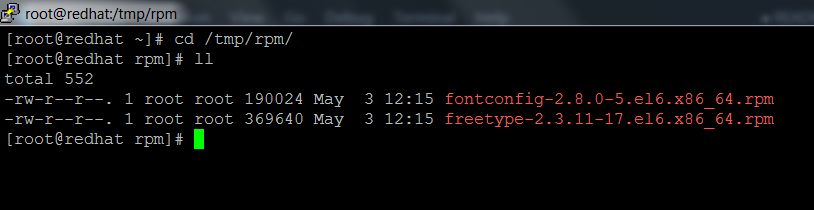
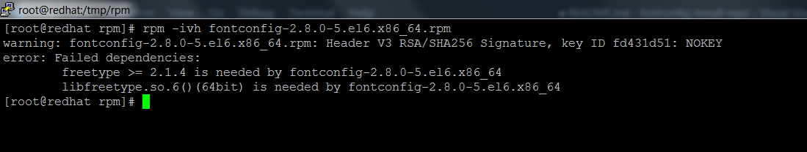
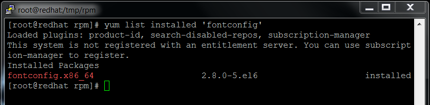
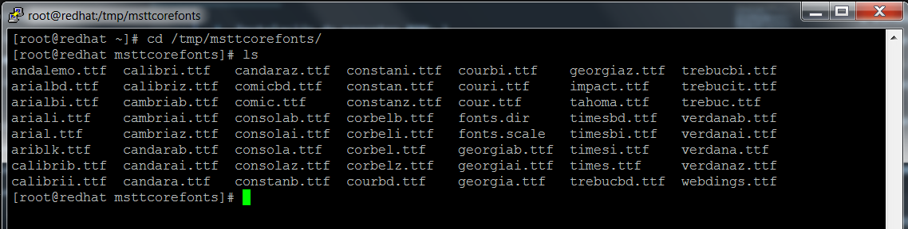
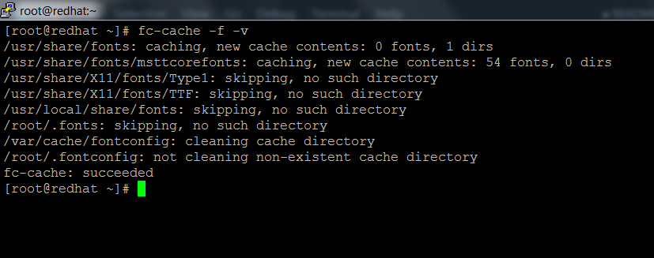
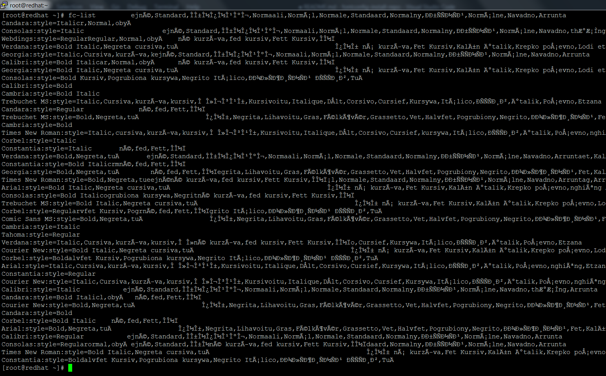
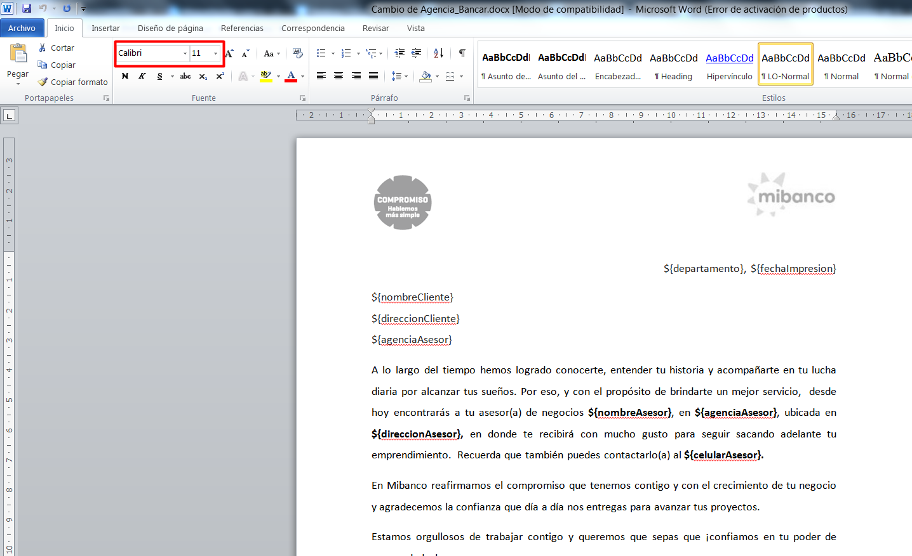
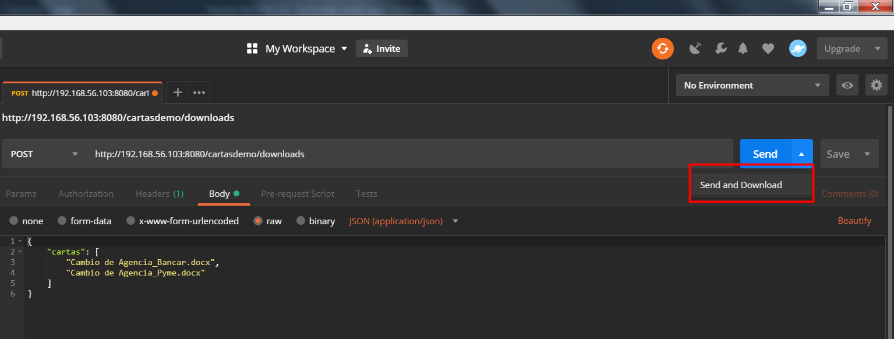
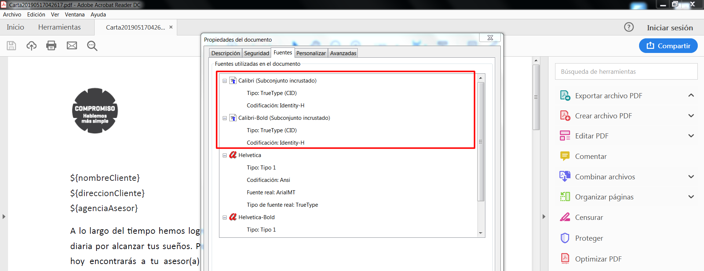

# **Manual de instalación de fuentes TTF en RHEL 6**

En el siguiente manual se detallarán los pasos a realizar para la instalación de fuentes TTF en RHEL 6. 

Se debe tener en consideración lo siguiente: 
- La instalación de packages necesarios se realizará de manera offline, ya que los servidores de aplicación de Mibanco (Desarrollo, QA, Producción) no cuentan con acceso a Internet. 
- No se especificó la versión exacta de RHEL instalado, por lo que se asume que se tiene la versión 6.10 (Dicha versión se usará en las pruebas de instalación de fuentes).
- El servidor debe tener previamente instalado Oracle JDK 8 y JBoss EAP 6.x para las pruebas con los servicios de generación de cartas con plantillas de Microsoft Word. 

---

## **Pasos previos**
- Descarga de fuentes TrueType y ClearType: \
  Las fuentes se descargaron siguiendo el manual: http://mscorefonts2.sourceforge.net

- Descarga de paquetes RPM: \
  Los paquetes RPM se descargaron del repositorio oficial de paquetes de RedHat: https://access.redhat.com/downloads/content/69/ver=/rhel---6/6.10/x86_64/packages 

  Los packages descargados son:
  - fontconfig
  - freetype

## **Instalación de paquetes RPM y fuentes**

1. Instalación de paquetes RPM: \
    Copie la carpeta con los paquetes RPM proporcionados (`resources/rpm`) a la carpeta `/tmp`. Después, a través de la terminal debe estar ubicado en la carpeta en la que copió los archivos para la instalación.
    \
    \
    

    Los archivos descargados se instalan con el siguiente comando: 
    ```console
    rpm -ivh <nombre archivo rpm>
    ```

    Se procede a instalar los packages en el siguiente orden: 

    #### **Instalación de fontconfig y dependencias:**

    - Instalación de dependencias:
        ```console
        rpm -ivh freetype-2.3.11-17.el6.x86_64.rpm
        ```
    - Instalación de **fontconfig**:
        ```console
        rpm -ivh fontconfig-2.8.0-5.el6.x86_64.rpm
        ```

    > Nota:\
    > En caso no se realice la instalación previa de las dependencias, es posible que salga el siguiente mensaje de error: 
    \
    \
    > 

    Puede verificar si el package fue instalado con el siguiente comando: 
    ```console
    yum list installed 'fontconfig'
    ```
    

2. Instalación de fuentes descargadas: \
    Copie las fuentes descargadas (Se encuentran en la carpeta `resources/fonts`) a la carpeta `/tmp`. 

    Copie la carpeta `msttcorefonts` a la siguiente ruta: `/usr/share/fonts`
    ```console
    cp -R /tmp/msttcorefonts/ /usr/share/fonts/
    ```
    

    Refresque la caché del fontconfig con el siguiente comando: 
    ```console
    fc-cache -f -v
    ```
    

    Puede verificar si las fuentes están instaladas con el siguiente comando: 
    ```console
    fc-list
    ```
    

    > Nota: \
    > Estos pasos también aplican para otras fuentes TTF.

## **Pruebas con cartas**

- Se verifica que una de las cartas esté con una fuente instalada (Ejm: Calibri) y se copia al servidor de desarrollo. \
  

- Se creó una REST API demo con Spring Boot para las pruebas con cartas, y se procede a ejecutar el servicio con Postman.
  \
  


  > Nota: \
  > El servicio demo tiene la funcionalidad de lectura de archivos Word y generación de PDF tal cual está en SigeServices. Se proporciona el proyecto demo para su verificación. (`demos/cartasdemo.zip`)

- Se verifica en las propiedades del PDF que tiene la fuente embebida. 
  \
  
