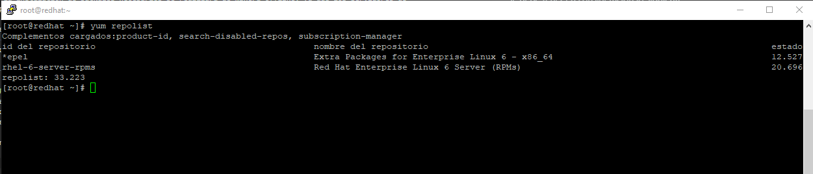
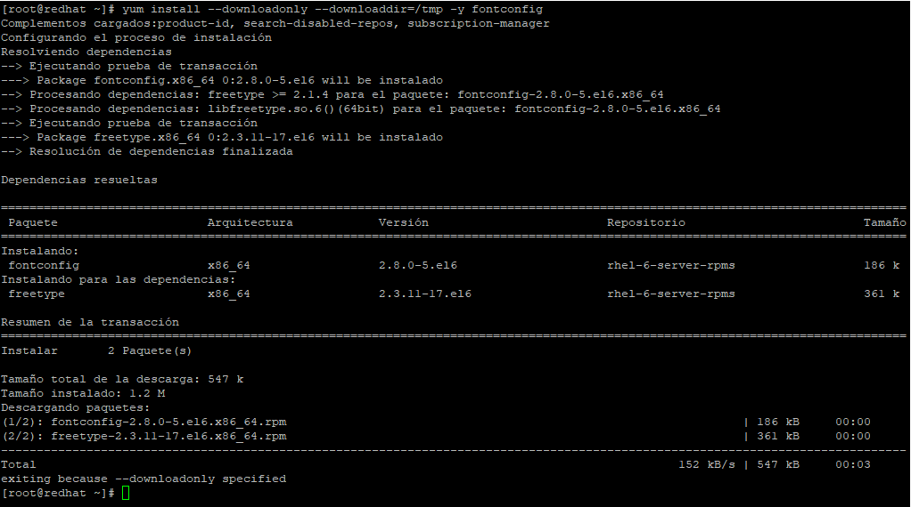
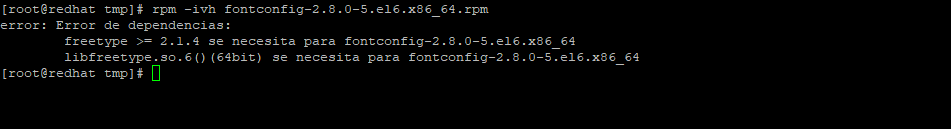

# **Manual de instalación de fuentes TTF en RHEL 6**

En el siguiente manual se detallarán los pasos a realizar para la instalación de fuentes TTF en RHEL 6. 

Se debe tener en consideración lo siguiente: 
- La instalación de packages necesarios se realizará de manera offline, ya que los servidores de aplicación de Mibanco (Desarrollo, QA, Producción) no cuentan con acceso a Internet. 
- No se especificó la versión exacta de RHEL instalado, por lo que se asume que se tiene la versión 6.10 (Dicha versión se usará en las pruebas de instalación de fuentes).
- El servidor debe tener previamente instalado Oracle JDK 8 y JBoss EAP 6.x para las pruebas con los servicios de generación de cartas con plantillas de Microsoft Word. 

---

## **1. Pasos previos**
Para realizar la descarga de los packages necesarios en la instalación, se debe contar con un equipo con RHEL 6/CentOS 6 instalado y con acceso a internet, para así garantizar que la descarga de los packages RPM se realicen desde los repositorios oficiales de RedHat. 

En las pruebas, el equipo con acceso a internet tiene acceso a los siguientes repositorios: 



Se procede a descargar los packages RPM con el siguiente comando: 
```console
yum install --downloadonly --downloaddir=/tmp -y fontconfig
```
> Notas:\
> - El comando mostrado descargará el package `fontconfig` con sus respectivas dependencias. Esto es importante para los pasos posteriores.
> - Para la prueba, se está configurando que los packages a descargar se guarden en la carpeta `/tmp`.



Se ingresa a la carpeta `/tmp` y se verifica que los packages han sido descargados: 


> Nota:\
> En caso no cuente con un equipo con salida a internet, se está proporcionando los archivos descargados en la carpeta `resources/rpm/` de este manual. Copie los archivos al servidor que desea instalar los packages, en la carpeta de su preferencia. 

---
## **2. Instalación de packages RPM**

Copie los archivos descargados en el paso previo en la carpeta de su preferencia (Para realizar el manual, se está copiando los archivos en la carpeta `/tmp/`). A través de la terminal, debe estar ubicado en la carpeta en la que copió los archivos para la instalación. 

Los archivos descargados se instalan con el siguiente comando: 
```console
rpm -ivh <nombre archivo rpm>
```

Se procede a instalar los packages en el siguiente orden: 

#### **Instalación de fontconfig y dependencias:**

- Instalación de dependencias:
    ```console
    rpm -ivh freetype-2.3.11-17.el6.x86_64.rpm
    ```
- Instalación de **fontconfig**:
    ```console
    rpm -ivh fontconfig-2.8.0-5.el6.x86_64.rpm
    ```

> Nota:\
> En caso no se realice la instalación previa de las dependencias, es posible que salga el siguiente mensaje de error: 
> 
